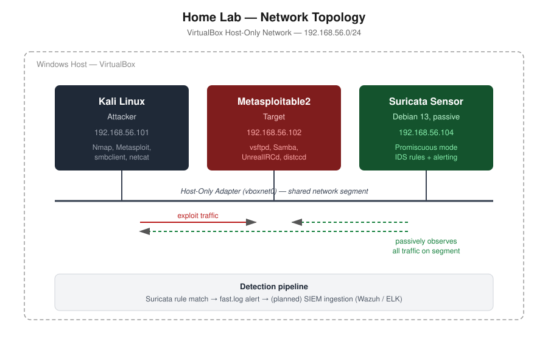

# SOC Analyst Home Lab Portfolio

Praktičan rad na eksploataciji, detekciji i analizi bezbednosnih ranjivosti
u kontrolisanom lab okruženju (Kali Linux + Metasploitable2, VirtualBox).
Svaki writeup pokriva ceo tok — od enumeracije, preko eksploatacije (ručne
i/ili preko Metasploit-a), do detekcije sa blue team ugla i predloga za
remedijaciju, sa MITRE ATT&CK mapiranjem.

## Kako ovo funkcioniše zajedno

Ovaj portfolio nije skup odvojenih vežbi — svaki deo se nadovezuje na prethodni
i zajedno čine kompletan security operations ciklus:

Prvo sam sagradio **monitoring infrastrukturu**: kompletan Wazuh SIEM stack
instaliran ručno (paket po paket, bez automated skripte), što je otkrilo sve
zavisnosti koje automated instalacija sakriva — TLS sertifikati, Filebeat kao
poseban log shipper, tačna imena konfiguracionih fajlova po komponenti. Realni
troubleshooting kroz DNS hijacking, disk probleme i systemd timeout-ove dokumentovan
je kao deo procesa, ne sakriven.

Zatim sam pisao **custom Suricata IDS pravila** za svaki exploit i integrisao ih sa
Wazuh-om kroz custom decoder/rules pristup (ne gotov modul), sa eksplicitnim MITRE
ATT&CK mapiranjem vidljivim u Threat Hunting dashboard-u. Svako pravilo testirano je
kroz stvaran exploit saobraćaj sa Kali VM-a ka Metasploitable2 meti.

Na kraju sam zatvorio petlju sa **Active Response**: kada Suricata uhvati exploit
pokušaj i Wazuh generiše alarm, sistem automatski blokira napadačev IP na nivou
firewall-a i automatski ga deblokira nakon definisanog timeout-a.

Rezultat: napad koji pokrenem sa Kali-ja → Suricata ga hvata na mreži → Wazuh
generiše alarm sa MITRE tagom → sistem automatski reaguje. Celi lanac, s kraja
na kraj.

## Topologija

## Infrastructure & SIEM Setup

Manuelna instalacija Wazuh SIEM stack-a (indexer, manager, dashboard) na
Ubuntu Server, uključujući TLS sertifikate, Filebeat integraciju i
troubleshooting realnih problema (DNS, disk, servisi):
[infrastructure/wazuh-siem-setup/README.md](infrastructure/wazuh-siem-setup/README.md)

Suricata IDS integrisan sa Wazuh-om preko custom decoder/rules pristupa,
sa MITRE ATT&CK mapiranjem vidljivim u Threat Hunting dashboard-u:
[infrastructure/wazuh-siem-setup/suricata-decoder-integration.md](infrastructure/wazuh-siem-setup/suricata-decoder-integration.md)

Wazuh Active Response — automatska iptables blokada napadačevog IP-a
kada custom Suricata pravilo okine alarm, sa auto-unblock nakon timeout-a:
[infrastructure/wazuh-siem-setup/active-response.md](infrastructure/wazuh-siem-setup/active-response.md)

## Writeup-ovi

| # | Naziv | CVE | Metod | MITRE ATT&CK |
|---|-------|-----|-------|---------------|
| 00 | [Recon](writeups/00-recon) | — | Nmap full scan | T1046, T1590 |
| 01 | [vsftpd 2.3.4 Backdoor](writeups/01-vsftpd-backdoor) | CVE-2011-2523 | Ručno + Metasploit | T1190, T1059 |
| 02 | [Samba usermap_script RCE](writeups/02-samba-usermap) | CVE-2007-2447 | Ručno + Metasploit | T1190, T1059, T1021.002 |
| 03 | [UnrealIRCd Backdoor](writeups/03-unrealircd-backdoor) | CVE-2010-2075 | Ručno + Metasploit | T1190, T1059 |
| 04 | [distcc RCE](writeups/04-distccd-rce) | CVE-2004-2687 | Metasploit | T1190, T1059 |

## Detection Engineering

Suricata IDS pravila testirana protiv svakog exploita iz tabele iznad,
uključujući dijagnostikovanje i rešavanje false positive problema.
Detalji: [detection-engineering/](detection-engineering)

## Alati korišćeni u lab-u
- Kali Linux (attacker)
- Metasploitable2 (target)
- Nmap, Metasploit Framework, smbclient, netcat
- Suricata IDS (custom pravila, MITRE ATT&CK mapiranje)
- Wazuh SIEM (indexer, manager, dashboard, Filebeat)
- VirtualBox (host-only mreža `192.168.56.0/24`)

## O meni

Prelazim iz data engineering-a u cybersecurity, sa fokusom na SOC Analyst
(L1/L2) pozicije. Background u fizičkoj hemiji i spektroskopiji (Univerzitet
u Beogradu), trenutno radim kao Data Integration Engineer u ZF Group. Ovaj
lab dokumentuje moj praktičan rad na razumevanju napada iz oba ugla —
ofanzivnog i defanzivnog — kao pripremu za SOC ulogu. Posedujem CompTIA
Security+ sertifikat.