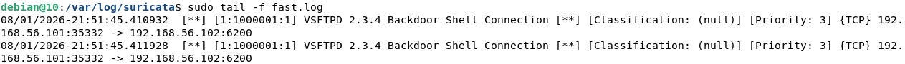
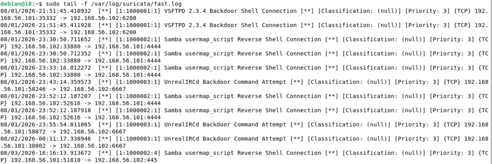
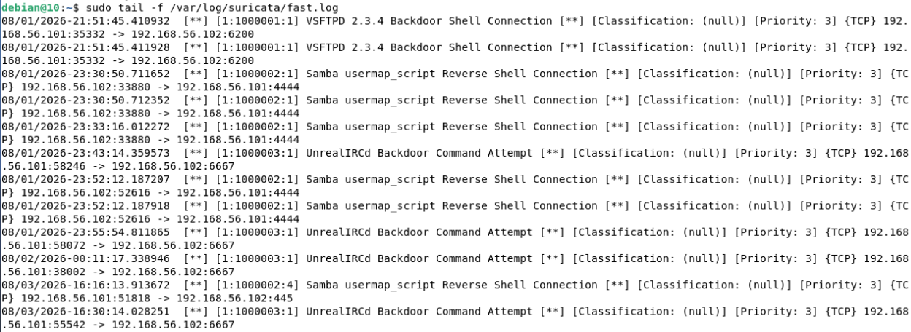
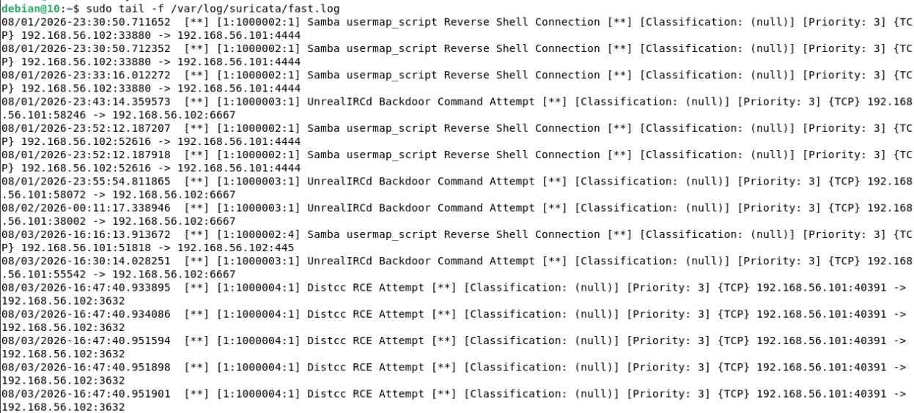

# Detection Engineering

Ovaj deo portfolija pomera fokus sa ofanzivne na defanzivnu stranu — umesto
da se pita "kako upasti", pita se "kako primetiti da je neko upao". Za svaki
exploit iz `writeups/` foldera napravljeno je Suricata pravilo, i svako je
**stvarno testirano** protiv pravog napada, ne samo napisano po uzoru na
IDS potpise iz writeup-ova.

## Setup

Suricata radi na posebnoj VM (`suricata-sensor`, Debian 13), odvojenoj od
Kali-ja i Metasploitable-a, na istoj VirtualBox host-only mreži
(`192.168.56.x`). Ideja je da sensor bude pasivan posmatrač saobraćaja
između napadača i mete — isto kao što bi u pravoj mreži postojao network
senzor koji ne učestvuje u komunikaciji, samo je osluškuje.

Dva mrežna adaptera na sensor VM-u:
- **NAT** — samo za internet pristup (apt install), ne koristi se za monitoring
- **Host-only** — ovde Suricata sluša, sa uključenim **Promiscuous Mode: Allow All**
  (bez ovoga VM vidi samo saobraćaj namenjen njemu samom, ne i tuđi promet)

Suricata je instalirana preko `apt`, konfigurisana da sluša na host-only
interfejsu (`enp0s8`), sa custom pravilima u posebnom fajlu
(`/var/lib/suricata/rules/custom.rules`), učitanim uz default rule set.

## Pravila

| Exploit | SID | Port(i) | Tip detekcije |
|---|---|---|---|
| vsftpd 2.3.4 backdoor | 1000001 | 6200 | flow-based |
| Samba usermap_script | 1000002 (rev 4) | 139, 445 | hex content match |
| UnrealIRCd backdoor | 1000003 | 6667 | content match |
| distccd RCE | 1000004 | 3632 | flow-based |

Kompletan rules fajl: [`rules/custom.rules`](rules/custom.rules)

---

### vsftpd 2.3.4 backdoor

alert tcp any any -> any 6200 (msg:"VSFTPD 2.3.4 Backdoor Shell Connection"; flow:established; sid:1000001; rev:1;)

Port 6200 se otvara samo nakon što se backdoor aktivira, pa je i sama
konekcija na taj port dovoljno pouzdan indikator — ne mora ništa posebno
da se traži unutar sadržaja paketa.

---

### Samba usermap_script — false positive i njegovo rešavanje

Ovo pravilo je prošlo kroz tri iteracije, i vredi ih sve opisati jer je tu
najviše naučeno.

**Prva verzija** je gledala samo port 4444 (port na koji Samba payload šalje
reverse shell):

alert tcp any any -> any 4444 (msg:"Samba usermap_script Reverse Shell Connection"; flow:established; sid:1000002; rev:1;)

Radila je — ali prilikom testiranja UnrealIRCd exploita (koji **takođe**
šalje reverse shell na port 4444), pravilo se pogrešno okinulo i prijavilo
Samba napad umesto UnrealIRCd. Razlog: pravilo je gledalo samo port, ne i
šta je stvarno karakteristično za Samba napad — pa je svaki reverse shell
na 4444 izgledao isto, bez obzira odakle stvarno dolazi.

**Druga verzija** je pokušala da to popravi tako što je gledala port 139
(SMB) i tražila reč `nohup` (deo originalnog payload-a) unutar sadržaja:

alert tcp any any -> any 139 (msg:"Samba usermap_script Command Injection Attempt"; content:"nohup"; sid:1000002; rev:2;)

Ovo nije uhvatilo ništa. Provera sa `tcpdump` je pokazala dve stvari:
1. Moderni `smbclient` po defaultu koristi port **445**, ne 139
2. SMB protokol enkodira username/path polja u **UTF-16LE**, gde svaki
   karakter ima null bajt iza sebe (`n\x00o\x00h\x00u\x00p\x00`) — obična
   ASCII pretraga `nohup` nikad ne bi mogla da nađe taj string

**Treća, konačna verzija** pokriva oba porta i traži tačan niz bajtova u
UTF-16LE formatu (hex notacija):

alert tcp any any -> any [139,445] (msg:"Samba usermap_script Command Injection Attempt"; content:"|6E 00 6F 00 68 00 75 00 70 00|"; sid:1000002; rev:4;)

Testirano i potvrđeno — hvata Samba napad ispravno, i više se ne okida
pogrešno kad se UnrealIRCd exploit izvede paralelno.

**Pouka:** port-based pravila su brza za napisati, ali lako prave false
positive kad dva različita napada slučajno dele isti izlazni port. Content
match je pouzdaniji, ali zahteva da se prvo proveri kako protokol stvarno
enkodira podatke na žici — pretpostavka da je sve običan ASCII tekst ovde
nije važila.

---

### UnrealIRCd backdoor

alert tcp any any -> any 6667 (msg:"UnrealIRCd Backdoor Command Attempt"; content:"AB"; sid:1000003; rev:1;)

Traži okidački string `AB` (koji backdoor kod prepoznaje kao početak
komande) direktno na IRC portu. Prvobitna verzija je uključivala `;` u
content string (`"AB;"`), što je pravilo `;` karakter unutar `content`
navodnika kao kraj opcije u samom pravilu — moralo se ukloniti da bi
parsing prošao.

---

### distccd RCE

alert tcp any any -> any 3632 (msg:"Distcc RCE Attempt"; flow:established; sid:1000004; rev:1;)

Isti princip kao vsftpd — port 3632 je specifičan za distcc servis, pa je
dovoljno pratiti uspostavljen flow na tom portu bez potrebe za dodatnim
content match-om.

---

## Šta bi dalje

- Dodavanje SIEM sloja (Wazuh ili ELK) da se ovi alert-i centralizuju i
  prikazuju kroz dashboard, umesto da se čitaju direktno iz `fast.log`
- Testiranje pravila protiv legitimnog saobraćaja (npr. normalan SMB
  file transfer) da se potvrdi da ne prave false positive i u tom pravcu
- Dodavanje pravila i za preostale exploite u portfoliju kako se budu
  dokumentovali