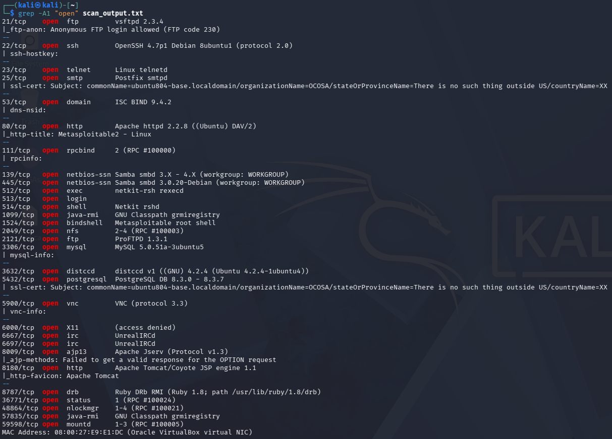

# Recon — Metasploitable2

Prva faza penetration testing procesa — pasivna i aktivna enumeracija cilja
kako bi se identifikovali otvoreni portovi, aktivni servisi i njihove verzije.
Rezultati ove faze direktno određuju prioritet i redosled eksploatacije u
narednim koracima.

## Cilj
- IP: 192.168.56.102
- Datum: 2026-07-13
- Alat: Nmap 7.99

## Komanda
nmap -sV -sC -p- -T4 -oN scan_output.txt 192.168.56.102

Objašnjenje flagova:
- `-sV` — detekcija verzija servisa
- `-sC` — default Nmap skripte (dodatna enumeracija)
- `-p-` — sken svih 65535 portova
- `-T4` — agresivnija brzina skeniranja
- `-oN scan_output.txt` — snima output u fajl

## MITRE ATT&CK
- T1046 – Network Service Discovery
- T1590 – Gather Victim Network Information

## Rezultat skeniranja

Pun raw output dostupan u [scan_output.txt](scan_output.txt).

## Ključni nalazi

| Port | Servis | Ranjivost |
|------|--------|-----------|
| 21/tcp | vsftpd 2.3.4 | Poznat backdoor (CVE-2011-2523), anonymous login dozvoljen |
| 23/tcp | Telnet | Plaintext protokol, nema enkripcije |
| 139,445/tcp | Samba 3.0.20 | usermap_script RCE (CVE-2007-2447) |
| 3632/tcp | distccd v1 | RCE (CVE-2004-2687) |
| 6667/tcp | UnrealIRCd | Backdoor (CVE-2010-2075) |
| 8180/tcp | Tomcat 5.5 | Verovatno default kredencijali (manager app) |

## Sledeći koraci
1. Ispitati vsftpd 2.3.4 backdoor (prioritet — klasičan, dobro dokumentovan)
2. Proveriti anonymous FTP sadržaj
3. Enumeracija Samba share-ova (enum4linux / smbclient)
4. Web enumeracija porta 80 (verovatno DVWA/Mutillidae)